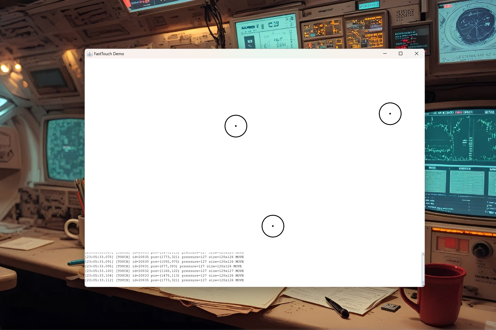

# FastTouch — Native Touchscreen Input for Java

**⚡ Ultra-fast native touchscreen input for Java — Multi-touch, pressure, and gestures impossible in pure Java**

[]()
[](https://www.java.com)
[]()
[](https://opensource.org/licenses/MIT)



> **🚧 WORK IN PROGRESS** - Native multi-touch touchscreen input via Windows API. See [TODO.md](TODO.md) for remaining features.

FastTouch provides **hardware-level touchscreen access** for Java applications — something impossible with standard AWT/Swing. Get raw touch data including:
- **Multi-touch** — Track 10+ fingers simultaneously  
- **Pressure sensitivity** — Variable touch force (0-255)
- **Contact size** — Touch width/height in pixels
- **Low latency** — Native Windows API, no JVM event queue delays

**Java CANNOT do this.** AWT only provides mouse emulation for touch. FastTouch gives you the real thing.

---

## 📦 Why FastTouch?

| Feature | Java AWT/Swing | FastTouch (JNI) |
|---------|---------------|-----------------|
| Multi-Touch | ❌ No (mouse emulation only) | ✅ 10+ simultaneous points |
| Pressure | ❌ No | ✅ 0-255 pressure levels |
| Contact Size | ❌ No | ✅ Width/Height in pixels |
| Raw Touch Events | ❌ No (synthesized mouse) | ✅ Native WM_TOUCH/WM_POINTER |
| Latency | High (event queue) | **Native speed** |

---

## 🚀 Quick Start

```java
import fasttouch.FastTouch;
import javax.swing.JFrame;

public class TouchDemo {
    public static void main(String[] args) {
        JFrame frame = new JFrame("FastTouch Demo");
        frame.setSize(800, 600);
        frame.setVisible(true);
        
        // Initialize native touch input
        FastTouch touch = FastTouch.create(frame);
        
        // Add touch listener
        touch.addListener(point -> {
            System.out.println("Touch " + point.id + 
                " at (" + point.x + "," + point.y + ")" +
                " pressure=" + point.pressure +
                " state=" + point.state);
        });
        
        // Start polling
        touch.start();
        
        // Your app runs here...
    }
}
```

---

## 📦 Installation

### Build from Source

```powershell
# PowerShell
.\build.ps1

# Run demo
cd out
java -cp . -Djava.library.path=. demo.TouchDemo
```

---

## 🎯 API Reference

### Core Methods

| Method | Description | Status |
|--------|-------------|--------|
| `FastTouch.create(window)` | Initialize touch for window | 🚧 WIP |
| `addListener(listener)` | Add touch event callback | 🚧 WIP |
| `start()` | Begin touch polling | 🚧 WIP |
| `stop()` | Stop touch polling | 🚧 WIP |
| `isTouchAvailable()` | Check if touchscreen present | 🚧 WIP |
| `getMaxTouchPoints()` | Get max simultaneous touches | 🚧 WIP |

### TouchPoint Fields

| Field | Type | Description |
|-------|------|-------------|
| `id` | int | Touch ID (tracking) |
| `x, y` | int | Screen coordinates |
| `pressure` | int | 0-255 pressure level |
| `width, height` | int | Contact size in pixels |
| `state` | State | DOWN / MOVE / UP |
| `timestamp` | long | Event time in ms |

---

## 🏗️ Build from Source

### Prerequisites
- Windows 10/11 with Touchscreen
- Java JDK 17+
- Visual Studio 2022 (C++ workload)

### Build
```powershell
.\build.ps1
```

---

## 📄 License

MIT License — See [LICENSE](LICENSE) for details.

---

**FastTouch** — *Because touch matters.*
