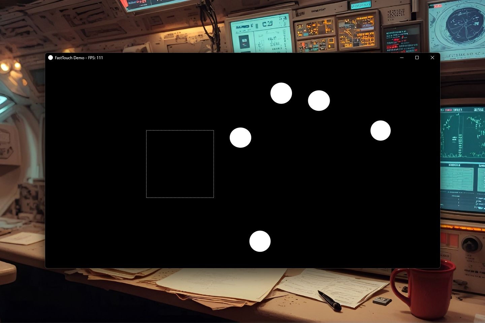

# FastTouch v0.1.0 [ALPHA] — Native touchscreen input for Java

[]()
[](https://jitpack.io/#andrestubbe/FastTouch)
[](https://www.java.com)
[]()
[](https://jitpack.io/#andrestubbe)

---

**⚡ Ultra-fast native touchscreen input for Java — Multi-touch, pressure, and gestures impossible in pure Java**

FastTouch provides **hardware-level touchscreen access** for Java applications — something impossible with standard
AWT/Swing. Get raw touch data including:
- **Multi-touch** — Track 10+ fingers simultaneously
- **Pressure sensitivity** — Variable touch force (0-255)
- **Contact size** — Touch width/height in pixels
- **Low latency** — Native Windows API, no JVM event queue delays
**Java CANNOT do this.** AWT only provides mouse emulation for touch. FastTouch gives you the real thing.

[**Watch the Demo**](YOUR_YOUTUBE_LINK_HERE) | [**Watch the JMH Benchmark**](YOUR_YOUTUBE_LINK_HERE)

---

[](https://www.youtube.com/watch?v=0DzGtGKu5D4)

---

## Table of Contents

- [Quick Start](#quick-start)
- [Why FastTouch?](#why-fasttouch)
- [Performance Benchmarks](#performance-benchmarks)
- [Installation](#-installation)
- [API Reference](#-api-reference)
- [Documentation](#documentation)
- [License](#license)
- [Related Projects](#related-projects)

---

## Quick Start

```java
import fasttouch.FastTouch;

import javax.swing.JFrame;

public class TouchDemo {
    public static void main(String[] args) {
        JFrame frame = new JFrame("FastTouch Demo");
        frame.setSize(800, 600);
        frame.setVisible(true);

        // Initialize native touch input
        FastTouch touch = FastTouch.create(frame);

        // Add touch listener
        touch.addListener(point -> {
            System.out.println("Touch " + point.id +
                    " at (" + point.x + "," + point.y + ")" +
                    " pressure=" + point.pressure +
                    " state=" + point.state);
        });

        // Start polling
        touch.start();

        // Your app runs here...
    }
}
```

---

## Why FastTouch?

| Feature          | Java AWT/Swing              | FastTouch (JNI)              |
|------------------|-----------------------------|------------------------------|
| Multi-Touch      | ❌ No (mouse emulation only) | ✅ 10+ simultaneous points    |
| Pressure         | ❌ No                        | ✅ 0-255 pressure levels      |
| Contact Size     | ❌ No                        | ✅ Width/Height in pixels     |
| Raw Touch Events | ❌ No (synthesized mouse)    | ✅ Native WM_TOUCH/WM_POINTER |
| Latency          | High (event queue)          | **Native speed**             |

---

## Performance Benchmarks

FastTouch relies on a highly optimized native JNI architecture. The `FastGesture` engine uses zero-allocation loops to process heavy mathematics (Panning, Pinch-to-Zoom, and Rotation vectors) directly from primitive arrays.

In the official [JMH Benchmark](examples/Benchmark), we measure the raw throughput of the gesture mathematics overhead:

```text
Benchmark                             Mode  Cnt      Score      Error   Units
TouchBenchmark.benchmarkGestureMath  thrpt    5  15229,163 ± 3349,252  ops/ms
```

> **~15,200,000 Operations per Second**: `FastGesture` scales, rotates, and translates coordinates with functionally zero latency. Given that a typical touch digitizer polls at 120Hz-240Hz, the Java computational overhead is completely unmeasurable.

---

## Installation

### Option 1: Maven (Recommended)

Add the JitPack repository and the dependency to your `pom.xml`:

```xml
<repositories>
    <repository>
        <id>jitpack.io</id>
        <url>https://jitpack.io</url>
    </repository>
</repositories>

<dependencies>
    <dependency>
        <groupId>com.github.andrestubbe</groupId>
        <artifactId>fasttouch</artifactId>
        <version>v0.1.0</version>
    </dependency>
    <!-- Required Native JNI loader -->
    <dependency>
        <groupId>com.github.andrestubbe</groupId>
        <artifactId>fastcore</artifactId>
        <version>v0.1.0</version>
    </dependency>
</dependencies>
```

### Option 2: Gradle (via JitPack)

```groovy
repositories {
    maven { url 'https://jitpack.io' }
}

dependencies {
    implementation 'com.github.andrestubbe:fasttouch:v0.1.0'
    // Required Native JNI loader
    implementation 'com.github.andrestubbe:fastcore:v0.1.0'
}
```

### Option 3: Direct Download (No Build Tool)

Download the latest JAR directly to add it to your classpath:

1. 📦 **[fasttouch-v0.1.0.jar](https://github.com/andrestubbe/FastTouch/releases/download/v0.1.0/fasttouch-v0.1.0.jar)** (The Core Library)
2. 📦 **[fastcore-v0.1.0.jar](https://github.com/andrestubbe/FastCore/releases/download/v0.1.0/fastcore-v0.1.0.jar)** (Required Native JNI loader)

---

## 🎯 API Reference

### FastTouch Core Methods

| Method                     | Description                  |
|----------------------------|------------------------------|
| `FastTouch.create(window)` | Initialize touch for window  |
| `addListener(listener)`    | Add touch event callback     |
| `removeListener(listener)` | Remove touch event callback  |
| `start()`                  | Begin touch processing       |
| `stop()`                   | Stop touch processing        |
| `isTouchAvailable()`       | Check if touchscreen present |
| `getMaxTouchPoints()`      | Get max simultaneous touches |

### FastGesture (Mathematical Engine)

A separate utility class, `FastGesture`, is included to translate raw multi-touch data into high-level interactions.

| Callback Method | Description |
|-----------------|-------------|
| `onPan`         | 1-Finger drag (provides physics-based torque data) |
| `onPinchStart`  | 2-Finger gesture initiated |
| `onPinchUpdate` | 2-Finger scaling, rotation, and distance delta |
| `onPinchEnd`    | 2-Finger gesture terminated |

### TouchPoint Fields

| Field           | Type  | Description            |
|-----------------|-------|------------------------|
| `id`            | int   | Touch ID (tracking)    |
| `x, y`          | int   | Screen coordinates     |
| `pressure`      | int   | 0-255 pressure level   |
| `width, height` | int   | Contact size in pixels |
| `state`         | State | DOWN / MOVE / UP       |
| `timestamp`     | long  | Event time in ms       |

---

## Documentation

* **[COMPILE.md](docs/COMPILE.md)**: Full compilation guide (MSVC C++17 build chain + JNI Setup).
* **[REFERENCE.md](docs/REFERENCE.md)**: Full API descriptions, border configurations, and codepoint index.
* **[PHILOSOPHIE.md](docs/PHILOSOPHIE.md)**: The engineering rationale for zero-allocation performance.
* **[ROADMAP.md](docs/ROADMAP.md)**: Future milestones and planned features.
* **[CHANGELOG.md](docs/CHANGELOG.md)**

---

## Platform Support

| Platform      | Status            |
|---------------|-------------------|
| Windows 10/11 | ✅ Fully Supported |
| Linux         | 🚧 Planned |
| macOS         | 🚧 Planned |

---

## License

MIT License — See [LICENSE](LICENSE) file for details.

---

## Related Projects
- [FastCore](https://github.com/andrestubbe/FastCore) — Native Library Loader & JNI Utilities for Java
- [FastStylus](https://github.com/andrestubbe/FastStylus) — Native Stylus/Pen Input for Java
- [FastHotkey](https://github.com/andrestubbe/FastHotkey) — Low-Latency Global Hotkey API for Java
- [FastKeyboard](https://github.com/andrestubbe/FastKeyboard) — Native Windows RawInput API for Java
- [FastKeylogger](https://github.com/andrestubbe/FastKeylogger) — Behavioral Typing Logic for Java
- [FastMouse](https://github.com/andrestubbe/FastMouse) — High-Performance Native Mouse API for Java
- [FastTheme](https://github.com/andrestubbe/FastTheme) — High-Performance Native Window Styling

---
**Part of the FastJava Ecosystem** — *Making the JVM faster. Small package. Maximum speed. Zero bloat. 🚀📋*


